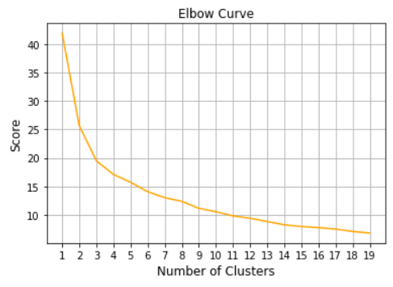
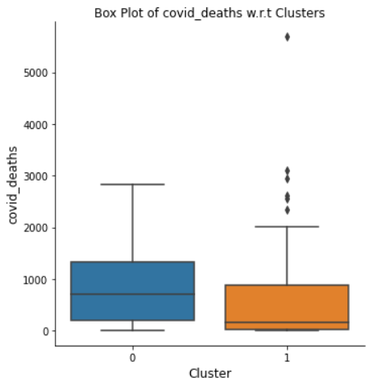

1. [Building Blocks of Convolutional Neural Network (CNN)](#building-blocks-of-convolutional-neural-network-(cnn))
2. [Improving Convolutional Neural Networks](#improving-convolutional-neural-networks)
3. [Classic CNN architectures](#classic-cnn-architectures)

<h3>1. Building Blocks of Convolutional Neural Network (CNN)</h3>
<h4>Convolutional Layer</h4>

- In CNN, we use feature detectors. These feature detectors extract different features from the input image like curves, edges, whiskers, tail, etc.
- Every image can be considered as a matrix of pixel values (range from 0 to 255). 

- Consider a 5 x 5 image whose pixel values are only 0 and 1.

- Also, consider another 3 x 3 matrix as shown below:

- Then, the Convolution of the 5 x 5 image and the 3 x 3 matrix can be computed as shown in the animation below:

- In CNN terminology, the 3×3 matrix is called a ‘filter‘ or ‘kernel’ or ‘<b>feature detector</b>’ and the matrix formed by sliding the filter over the image and computing the dot product is called the ‘Convolved Feature’ or ‘Activation Map’ or the ‘<b>Feature Map</b>‘. It is important to note that filters acts as feature detectors from the original input image.
- It is evident from the animation above that different values of the filter matrix will produce different Feature Maps for the same input image. As an example, consider the following input image:

- In the table below, we can see the effects of convolution of the above image with different filters. As shown, we can perform operations such as Edge Detection, Sharpen and Blur just by changing the numeric values of our filter matrix before the convolution operation – this means that different filters can detect different features from an image, for example edges, curves etc.

- The learnt feature detectors can look something like in the below image.

<em>Example filters learned by Krizhevsky et al</em>

- Another good way to understand the Convolution operation is by looking at the animation below:

- A filter (with red outline) slides over the input image (convolution operation) to produce a feature map. The convolution of another filter (with the green outline), over the same image gives a different feature map as shown. It is important to note that the Convolution operation captures the local dependencies in the original image. Also notice how these two different filters generate different feature maps from the same original image.
- In practice, a CNN *learns* the values of these filters on its own during the training process (although we still need to specify parameters such as number of filters, filter size, architecture of the network etc. before the training process). 
- The size of the Feature Map (Convolved Feature) is controlled by three parameters that we need to decide before the convolution step is performed:
  - <b>Depth:</b> Depth corresponds to the number of filters we use for the convolution operation. The more number of filters we have, the more image features get extracted and the better our network becomes at recognizing patterns in unseen images.
  - <b>Stride:</b> Stride is the number of pixels by which we slide our filter matrix over the input matrix.
  - <b>Zero-padding:</b> Sometimes, it is convenient to pad the input matrix with zeros around the border, so that we can apply the filter to bordering elements of our input image matrix. A nice feature of zero padding is that it allows us to control the size of the feature maps.

<h4>Introducing Non Linearity (ReLU)</h4>

- ReLU stands for Rectified Linear Unit and is a non-linear operation. Its output is given by:

- ReLU is an element wise operation (applied per pixel) and replaces all negative pixel values in the feature map by zero. The purpose of ReLU is to introduce non-linearity in our ConvNet, since most of the real-world data we would want our ConvNet to learn would be non-linear (Convolution is a linear operation – element wise matrix multiplication and addition, so we account for non-linearity by introducing a non-linear function like ReLU).

- The ReLU operation can be understood clearly from the below figure. The output feature map here is also referred to as the ‘Rectified’ feature map.

- Other non linear functions such as <b>tanh</b> or <b>sigmoid</b> can also be used instead of ReLU, but ReLU has been found to perform better in most situations.

<h5>Why a convolutional layer is more useful than a fully connected layer?</h5>

- <b>Parameter Sharing</b>
  - The same feature detector can be used at different places of the image. For example, a 3x3 filter for vertical edges can be used for different positions in the image.
- <b>Sparse Connections</b>
  - A convolutional layer has a lot fewer trainable parameters as compared to a fully connected layer. Because of the this property, a CNN can be trained on smaller training sets with less prone to overfitting.

<h4>Pooling Layer</h4>

- Spatial Pooling (also called subsampling or downsampling) reduces the dimensionality of each feature map but retains the most important information. Spatial Pooling can be of different types: Max, Average, Sum etc.
- In case of Max Pooling, we define a spatial neighborhood (for example, a 2×2 window) and take the largest element from the rectified feature map within that window. Instead of taking the largest element we could also take the average (Average Pooling) or sum of all elements in that window. In practice, Max Pooling has been shown to work better.
- The below figure shows an example of Max Pooling operation on a Rectified Feature map (obtained after convolution + ReLU operation) by using a 2×2 window.

- We slide our 2 x 2 window by 2 cells (also called ‘stride’) and take the maximum value in each region. This reduces the dimensionality of our feature map.
- Pooling operation is applied separately to each feature map.
- The below shows the effect of Pooling on the Rectified Feature Map we received after the ReLU operation.

- The function of Pooling is to progressively reduce the spatial size of the input representation [[4](http://cs231n.github.io/convolutional-networks/)]. In particular, pooling
  - makes the input representations (feature dimension) smaller and more manageable
  - reduces the number of parameters and computations in the network, therefore, controlling overfitting
  - makes the network invariant to small transformations, distortions and translations in the input image (a small distortion in input will not change the output of Pooling – since we take the maximum / average value in a local neighborhood).
  - helps us arrive at an almost scale invariant representation of our image (the exact term is “equivariant”). This is very powerful since we can detect objects in an image no matter where they are located.
- In a CNN, it is customary to stack series of convolutional and pooling layers.

Together these layers extract the useful features from the images, introduce non-linearity in our network and reduce feature dimension while aiming to make the features somewhat equivariant to scale and translation

<h4>Flattening Layer</h4> 

- The output of the pooling layer is flattened i.e; each column of pooling output is stacked one upon another.

<h4>Fully Connected Layer</h4> 

- The Fully Connected layer is a traditional Multi Layer Perceptron. Each neuron in the fully connected layer is connected to every output of the previous layer. There can be multiple fully connected layers towards the end of the network.

- The output from the convolutional and pooling layers represent high-level features of the input image. The purpose of the Fully Connected layer is to use these features for classifying the input image into various classes based on the training dataset. 

<h4>Output Layer</h4> 

- This is the final layer that outputs the predictions. The number of neurons and the type of activation function for this layer depend upon the number of classes in the target variable and the type of the target variable respectively.

<h4>A Simple ConvNet</h4>

<h4>Training a ConvNet</h4>

The overall training process of the Convolution Network may be summarized as below:

- <b>Step 1</b>: We initialize all filters and parameters / weights with random values

- <b>Step 2</b>: The network takes a training image as input, goes through the forward propagation step (convolution, ReLU and pooling operations along with forward propagation in the Fully Connected layer) and finds the output probabilities for each class.
  - Lets say the output probabilities for the boat image above (assuming 4 classes) are [0.2, 0.4, 0.1, 0.3]
  - Since weights are randomly assigned for the first training example, output probabilities are also random.

- <b>Step 3</b>: Calculate the total error at the output layer (summation over all 4 classes)
  -  <b>Total Error = ∑  ½ (target probability – output probability) ²</b>

- <b>Step 4</b>: Use Backpropagation to calculate the gradients of the error with respect to all weights in the network and use gradient descent to update all filter values / weights and parameter values to minimize the output error.
  - The weights are adjusted in proportion to their contribution to the total error.
  - When the same image is input again, output probabilities might now be [0.1, 0.1, 0.7, 0.1], which is closer to the target vector [0, 0, 1, 0].
  - This means that the network has *learnt* to classify this particular image correctly by adjusting its weights / filters such that the output error is reduced.
  - Parameters like number of filters, filter sizes, architecture of the network etc. have all been fixed before Step 1 and do not change during training process – only the values of the filter matrix and connection weights get updated.

- <b>Step 5:</b> Repeat steps 2-4 with all images in the training set.

<h3>2. Improving Convolutional Neural Networks</h3>

- <b>Dealing high bias</b>:High error both on the training set and the validation set implies presence of high bias in the network. We can try one or combination of the following remedies

  - try bigger network -  more number of layers, more number of hidden units
  - train for more iterations

- <b>Handling high variance</b>: High error on the validation set and low error on the training set implies the presence of high variance in the model. We can try one or combination of the following remidies

  - get more data
  - use regularization techniques like L2 regularization, dropout, etc.

- <b>Data Augumentation</b>

  - It used when we have less data to overcome the problem of overfitting by the network.
  - It involves various operations on the images like mirroring , randomized large crops, rotating, shearing, color shifting, etc.
  - This technique helps us to aggrandize the size of the training data which can help prevent overfitting.

- <b>Dropout</b>: It is a regularization technique in which a proportion neurons in a particular layer are randomly turned off for each batch or for each epoch. This technique of randomly removing neurons from the network makes it simpler and the network will be reluctant to give more weightage to any one input. This prevents overfitting.

- <b>Transfer Learning</b>

  - It is a technique in which sophisticated models that were trained using large datasets and powerful computing resources are used for similar tasks without the need for training.
  - It is most useful when the problem at hand does not have sufficient data to train a sophisticated model.

- <b>Speeding up training process by normalizing inputs</b> 

  - When the inputs are on different scales the cost function will look like a squished out and elongated bowl.

  

  - As a result small, a learning rate should be used to prevent too much oscillation before it finally finds it's way towards the minimum
  - On the other hand, when the inputs are on the same scale, the cost function will look more symmetric.

  

  - In such case, the gradient descent can pretty much go straight to the minimum. This can speed up the training process.
  - We can bring the inputs on to the same scale by normalizing the inputs.

- <b>Vanishing and Exploding Gradients</b>
  - In deep neural networks, gradients can become very big or very very small if the parameters are not initialized appropriately. 
  - Both vanishing gradients and exploding gradients can make training difficult and slows down the gradient descent.
  - To overcome this problem, we can Xavier weight initialization or He weight initialization depending upon the activation function used.
- <b>Optimizers</b>
  - The type of gradient descent algorithm can affect the speed of training. A few of the popular optimizers are SGD, RMSprop, Adam, etc.
  - Below is a comparison of the convergence speed of different optimizers.

- <b>Batch Normalization</b>: Benefits of batch normalization are as follows:
  - speeds up training by normalizing intermediate activations
  - weights in deeper layers are made more robust to changes to weights in initial layers as batch normalization reduces the amount of distribution of the hidden unit values. In other words, batch normalization can better handle covariate shift.
  - one side effect of batch normalization is regularization i.e; it reduces overfitting

<h3>3. Classic CNN architectures</h3>

<h4>VGG-16</h4>

- VGG16 is a convolutional neural network model proposed by K. Simonyan and A. Zisserman from the University of Oxford in the paper “Very Deep Convolutional Networks for Large-Scale Image Recognition”. 
- The model achieves 92.7% top-5 test accuracy in ImageNet, which is a dataset of over 14 million images belonging to 1000 classes. It was one of the famous model submitted to [ILSVRC-2014](http://www.image-net.org/challenges/LSVRC/2014/results). 
- It makes the improvement over AlexNet by replacing large kernel-sized filters (11 and 5 in the first and second convolutional layer, respectively) with multiple 3×3 kernel-sized filters one after another.
- It has 138 million parameters.

<h4>ResNet</h4>

- Very deep neural networks suffer from vanishing and exploding gradients
- As a result, the training error gets worse as depth of the neural network increases.
- If a neural network is deep, its activations can get diminished. By using skip connections (residual connections), these activation values can be revived.
- In deep neural networks, it will be difficult to choose parameters that can learn even the identity function. 
- In ResNet, the deeper layers will be able to learn at least the identity function that guarantees no hurting of performance and increases the performance of the neural network a lot of times.

<h4>Inception</h4>

- Salient parts in the image can have extremely large variation in size. For instance, an image with a dog can be either of the following, as shown below. The area occupied by the dog is different in each image.

- Because of this huge variation in the location of the information, choosing the **right kernel size** for the convolution operation becomes tough. A **larger kernel** is preferred for information that is distributed more **globally**, and a **smaller kernel** is preferred for information that is distributed more locally.
- Why not have filters with **multiple sizes** operate on the **same level**? The network essentially would get a bit “**wider**” rather than “deeper”.
- Take multiple kernel filter sizes within the CNN, and rather than stacking them sequentially, ordering them to operate on the same level. Multiple kernel filter sizes arranged in such a manner are called Inception Modules. 

<a href="https://arxiv.org/pdf/1409.4842v1.pdf"><em>Image Source</em></a>

- Inception Modules are used in Convolutional Neural Networks to allow for more efficient computation and deeper networks through a dimensionality reduction with stacked 1×1 convolutions.

<a href="https://arxiv.org/pdf/1409.4842v1.pdf"><em>Image Source</em></a>

- Using the dimension reduced inception module, a neural network architecture was built. This is popularly known as GoogLeNet (Inception v1). The architecture is shown below:

<a href="https://arxiv.org/pdf/1409.4842v1.pdf"><em>Image Source</em></a>

<em>References</em>

<em>1. https://ujjwalkarn.me/2016/08/11/intuitive-explanation-convnets/</em>

<em>2. https://cs231n.github.io/convolutional-networks/</em>

<em>3. https://www.coursera.org/learn/convolutional-neural-networks</em>

[Go to top](#top)

[Code Implementation]()

