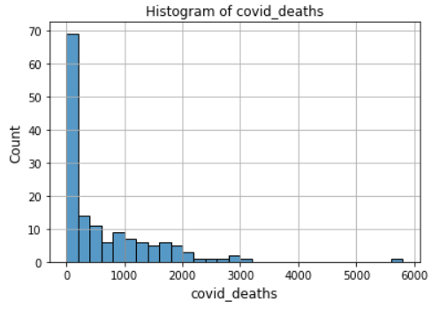

<b>Investigating the relationship between World Development Indicators(WDI) and the severity of the COVID-19 pandemic through Data Mining</b>

[Click here for Code Implementation]()

**Abstract**

The COVID-19 pandemic engulfed the world when everyone least expected it. It kept the whole world grappling for whatever respite it would get hold of. The countries around the world struggled to come up with ad hoc solutions to stifle the pandemic. What can be done to make the world better prepared for such pandemics? This project is intended to provide answers to the question through data analysis. Data analysis was carried out to identify relationships between the predictor(World Development Indicators) and response(*covid_deaths*) variables. Based on the preliminary analysis and the results from the clustering and classification algorithms, it has been concluded that World Development Indicators can play a significant role in predicting the casualties due to the COVID-19 pandemic.

 

**Contents**

1. Introduction 

2. Data Preprocessing 

3. Preliminary Analysis 

4. Clustering 

   4.1 K-Means Clustering 

   4.2 Agglomerative Clustering 

5. Logistic Regression 

6. Multiclass Classification

7. Conclusion 

 

**Word Count**: 2149

**1.**     **Introduction**

The primary goal of this project is to investigate the relationship between World Development Indicators (WDI) and the severity of the COVID-19 pandemic and find out to what extent WDI data can be used to predict the causalities of similar pandemics through preliminary analysis followed by the implementation of clustering and classification techniques. The dataset for this project consists of the World Development Indicators (WDI), derived from a primary World Bank database, and the information about the casualties of the COVID-19 pandemic. Python was used to conduct the statistical analysis. The data description is available in Table 1.

| Column Name  | Description                                                  |
| ------------ | ------------------------------------------------------------ |
| country      | Name of the country                                          |
| child_mort   | Death of children under 5 years of   age per 1000 live births |
| exports      | Exports of goods and services per   capita. Given as %age of the GDP per capita |
| health       | Total health spending per capita.   Given as %age of GDP per capita |
| imports      | Imports of goods and services per   capita. Given as %age of the GDP per capita |
| Income       | Net income per person                                        |
| Inflation    | The measurement of the annual   growth rate of the Total GDP |
| life_expec   | The average number of years a new   born child would live if the current mortality patterns are to remain the   same |
| total_fer    | The number of children that would   be born to each woman if the current age-fertility rates remain the same. |
| gdpp         | The GDP per capita. Calculated as   the Total GDP divided by the total population. |
| pop_dens     | Population Density in km^2                                   |
| continent    | The continent on which a country   is located. EU - Europe, AS - Asia, AF - Africa, NA - North America, SA -   South America, OC - Ocenia |
| covid_deaths | No. of COVID deaths per 1M people   as of June 2021          |

Table 1: Data Description

**2.**     **Data Preprocessing**

In the provided dataset, there are spelling mistakes in the country names and continent abbreviations and there is a pattern in those mistakes. Instead of "na" or “NA” in the spelling, there is "NAM". So, preprocessing was carried out to replace "NAM" with "na" in the country names and “NAM” with “NA” in the continent abbreviations.

 

**3.**     **Preliminary Analysis**

| Mean    | Std   | Min  | Q1    | Q2    | Q3      | Max  |
| ------- | ----- | ---- | ----- | ----- | ------- | ---- |
| 654.798 | 856.2 | 0.3  | 34.75 | 284.5 | 1099.25 | 5692 |

Table 2: Descriptive Statistics on covid_deaths

As can be seen from Table 2, the mean and median for covid_deaths are quite different. Moreover, the standard deviation is also high. This implies that the variable *covid_deaths* is highly skewed. We can observe the same in Graph 1 as well. From Graph 1, we can see that most of the countries have the number of COVID deaths per 1 million people below 400. 

Graph 1: Histogram of covid_deaths

| child_mort | exports | health | imports | income | inflation | life_expec | total_fer | gdpp  | pop_dens |
| ---------- | ------- | ------ | ------- | ------ | --------- | ---------- | --------- | ----- | -------- |
| -0.460     | 0.149   | 0.372  | 0.072   | 0.206  | -0.237    | 0.459      | -0.474    | 0.197 | -0.058   |

Table 3: Pearson’s Correlation of WDI with casualties of COVID-19 pandemic.

 

From Table 3, it is worth noticing the correlation of child mortality (*child_mort*), life expectancy (*life_expec*), and total fertility(*total_fer*) with casualties of the COVID-19 pandemic. Child mortality and total fertility are negatively correlated with COVID-19 deaths which implies that in countries where child mortality and total fertility are low, deaths due to COVID-19 per million people are more. In contrast, life expectancy is positively correlated with deaths due to COVID-19 which implies that COVID-19 deaths are more in countries with high life expectancy.

 

**4.**     **Clustering**

**4.1 K-Means Clustering**

K-Means clustering has been performed on the data without considering *country*, *continent*, and *covid_deaths* variables. As K-Means clustering is not scale equivariant, Min-Max normalization has been performed on the data. Based on the Elbow Curve Graph 2, it has been concluded that choosing 3 clusters would be good enough to form clusters with low inertia as well as the number of clusters would be low enough to facilitate easy comparison of the characteristics of different clusters with respect to each other.

Graph 2: Elbow Curve

 

| Cluster 0 |       | Cluster 1 |       | Cluster 2 |       |
| --------- | ----- | --------- | ----- | --------- | ----- |
| Continent | Count | Continent | Count | Continent | Count |
| EU        | 21    | AF        | 35    | AS        | 26    |
| AS        | 7     | AS        | 6     | EU        | 16    |
| NA        | 2     | NA        | 1     | NA        | 12    |
| OC        | 2     |           |       | SA        | 11    |
|           |       |           |       | AF        | 7     |
|           |       |           |       | OC        | 2     |

Table 4: Clusters from K-Means Clustering

Graph 3: Box Plot of *covid_deaths* w.r.t Clusters

 

Based on Tables 4, and Graph 3, we can infer the following:

●      Cluster 0 is primarily composed of European countries. The median of *covid_deaths* is close to 1000 and has a maximum of around 2900. 

●      Cluster 1 is primarily composed of African countries. The values of *covid_deaths* are relatively low in this cluster as compared to the rest of the clusters. 

●      Cluster 2 is primarily composed of Asian countries with a substantial number of countries from Europe, North America, and South America. The median of *covid_deaths* for this cluster is close to 500. However, the variance of *covid_deaths* for this cluster is the highest among all the three clusters. The maximum value of covid_deaths for this cluster is close to 6000. 

 

| Cluster | child_mort | exports | health  | imports | income  | inflation | life_expec | total_fer | gdpp    | pop_dens |
| ------- | ---------- | ------- | ------- | ------- | ------- | --------- | ---------- | --------- | ------- | -------- |
| 0       | 0.01144    | 0.30248 | 0.45319 | 0.29909 | 0.36204 | 0.05458   | 0.95118    | 0.08846   | 0.41783 | 0.13538  |
| 1       | 0.44794    | 0.16859 | 0.26183 | 0.27115 | 0.02475 | 0.14752   | 0.53653    | 0.62433   | 0.01457 | 0.05278  |
| 2       | 0.09542    | 0.22796 | 0.26946 | 0.29671 | 0.09382 | 0.106     | 0.80377    | 0.16009   | 0.05975 | 0.07589  |

 

Table 5: Cluster Centers 

Based on Table 5 and Graph 3, one can conclude that in countries where (the values for different variables in the following tables are with respect to cluster centers):

| child_mort | exports | health | imports | income | inflation | life_expec | total_fer | gdpp | pop_dens |
| ---------- | ------- | ------ | ------- | ------ | --------- | ---------- | --------- | ---- | -------- |
| High       | Low     | Low    | Low     | Low    | High      | Low        | High      | Low  | Low      |

 

the values of *covid_deaths* are relatively low. These countries belong to Cluster 1 which is primarily composed of African countries.

In countries where:

| child_mort | exports | health | imports | income | inflation | life_expec | total_fer | gdpp | pop_dens |
| ---------- | ------- | ------ | ------- | ------ | --------- | ---------- | --------- | ---- | -------- |
| Low        | High    | High   | High    | High   | Low       | High       | Low       | High | High     |

(or)

| child_mort | exports | health | imports | income | inflation | life_expec | total_fer | gdpp   | pop_dens |
| ---------- | ------- | ------ | ------- | ------ | --------- | ---------- | --------- | ------ | -------- |
| Medium     | Medium  | Medium | Medium  | Medium | Medium    | Medium     | Medium    | Medium | Medium   |

 

the values of *covid_deaths* are relatively high. These countries belong to either Cluster 0 which is 

primarily composed of European countries or Cluster 2 which is primarily composed of Asian countries with a substantial number of countries from Europe, North America, and South America. We can see that the relations between the variables and *covid_deaths* in K Means Clustering are consistent with the findings in the Preliminary Analysis

 

**4.2 Agglomerative Clustering**

Based on the Dendrogram shown in Graph 4, it has been concluded to form 2 clusters. The results of Agglomerative Clustering are as follows:

Graph 4: Dendrogram

 

Clusters from Agglomerative Clustering

| Cluster   0 |       | Cluster   1 |       |
| ----------- | ----- | ----------- | ----- |
| Continent   | Count | Continent   | Count |
| EU          | 21    | AF          | 40    |
| AS          | 8     | AS          | 31    |
| NA          | 3     | EU          | 16    |
| AF          | 2     | NA          | 12    |
| OC          | 2     | SA          | 11    |
|             |       | OC          | 2     |

Table 6

 

Box Plot of covid_deaths w.r.t Clusters

   

Graph 5

Based on Table 6 and Graph 5, we can infer that:

●      Cluster 0 primarily consists of Europe whereas Cluster 1 consists of Africa, South America, most countries of Asia, North America, and a tangible number from Europe. Both Clusters have an equal number of Oceania countries.

●      Agglomerative Clustering did a poor job in clustering because there are no distinguishing characteristics between both the clusters with respect to *covid_deaths*.

●      This can be attributed to the fact that the number of chosen clusters from the dendrogram will work only if ultrametric tree inequality holds true. It seems like that is not the case.

 

**5.**     **Logistic Regression**

For building a logistic regression model, *covid_deaths* has been converted into a binary categorical variable. The 25th percentile of *covid_deaths*, which is 34.75 has been taken as the threshold and the countries that have *covid_deaths* less than or equal to 34.75 as considered to have low casualties due to the pandemic while the countries with *covid_deaths* greater than 34.75 are considered to have high casualties of COVID-19. The *continent* variable which is a categorical variable has been converted to numeric variables using one-hot encoding. 

 

Coefficients of variables in Logistic Regression model

| child_mort | exports  | health   | imports  | income   | inflation | life_expec | total_fer |
| ---------- | -------- | -------- | -------- | -------- | --------- | ---------- | --------- |
| -0.02181   | 0.011842 | 0.001057 | -0.00704 | -0.00002 | -0.00291  | 0.028341   | -0.00181  |
|            |          |          |          |          |           |            |           |
| gdpp       | pop_dens | AS       | EU       | NA       | OC        | SA         | Intercept |
| 0.0000451  | -0.0008  | -0.00087 | 0.001281 | 0.000451 | -0.00144  | 0.000907   | 0.0003277 |

Table 7

In a logistic regression model, if the coefficient for a variable is positive, then increasing that variable causes the probability to increase. On the contrary, if the coefficient of a variable is negative, then increasing that variable causes the probability to decrease.

It follows from the above statements that based on Table 7:

●      An increase in *child_mort* will decrease the probability of a country being classified as having high casualties.

●      Similar is the case with the variables *imports, income, inflation, and total_fer*. Moreover, a country in Asia or Oceania is less likely to be classified as having high COVID-19 casualties than a country in Africa.

●      However, an increase in the variables *exports, health, life_expec, gdpp*, and *pop_dens* will increase the probability of a country being classified as having high COVID-19 casualties.

●      Furthermore, a country in Europe, North America, or South America is more likely to be classified as having high COVID-19 casualties than a country in Africa.

●      The coefficients of imports and income are negative (when the opposite should be the case based on the Preliminary Analysis) because of the effects of other variables in the logistic regression model.

 

Table 8 shows that there is no noticeable overfitting. Given the small size of the data, using machine learning algorithms with high degrees of freedom will lead to overfitting. Hence, the Logistic Regression model did a good job in reducing the variance.

 

|               | Accuracy | Recall | Precision |
| ------------- | -------- | ------ | --------- |
| Training Data | 80.18%   | 91.56% | 83.51%    |
| Test Data     | 78.37%   | 85.71% | 78.78%    |

Table 8: Performance on Evaluation Metrics

For this case, Recall is more important than Precision because falsely classifying a country as having low COVID-19 casualties would deprive the country of all the financial and healthcare support that it would otherwise receive. This will lead to the loss of many lives.

 

**6.**     **Multiclass Classification**

The variable covid_deaths has been converted into four classes - 0, 1, 2, and 3 based on quartiles(Q1, Q2, and Q3). Details are in Table 9. 

|              | Class 0      | Class 1                  | Class 2                          | Class 3        |
| ------------ | ------------ | ------------------------ | -------------------------------- | -------------- |
| covid_deaths | <  34.75(Q1) | >= 34.75 and < 284.5(Q2) | >= 284.5(Q2) and <   1099.25(Q3) | >= 1099.25(Q3) |

Table 9: Classes Criteria

The continent variable which a categorical variable has been converted to numeric variables using one-hot encoding. As LDA and QDA are not scale equivariant, standardized data has been used to train LDA and QDA models. The performance of Logistic Regression, LDA and QDA on accuracy score is tabulated in Table 10

Accuracy Scores

|               | Logistic Regression | LDA    | QDA    |
| ------------- | ------------------- | ------ | ------ |
| Training Data | 62.16%              | 65.76% | 41.44% |
| Test Data     | 48.64%              | 51.35% | 21.6%  |

Table 10

We can draw the following conclusions based on Table 10:

●      There is overfitting in Logistic Regression and LDA models. This can be attributed to less training data for each class.

●      LDA performed slightly better than the Logistic Regression model because the distribution of the variables in each class must be following a Gaussian Distribution and they have a common covariance matrix.

●      QDA performed worse because the decision boundary must be linear and it suffers from higher variance without a corresponding decrease in bias.

 

**7.**     **Conclusion**

Based on the Preliminary Analysis and the results from K Means Clustering and Logistic Regression for binary class classification, one can conclude that WDI can be used to predict the casualties of similar pandemics. However, it would be difficult to predict the casualties at a much granular level as the models for multiclass classification did poorly on the evaluation metrics. Getting more data might be helpful in improving the performance of the models on multiclass classification. Should the same relationships between the predictor and response variables be expected in the future? The answer is no definite answer. It can be said that no country was prepared to face the COVID-19 pandemic. No one actually anticipated it in the first place. Now that the world is having a bitter experience with the COVID-19 pandemic, countries will work on improving their healthcare infrastructure to better handle pandemics in the future. Hence, there is a probability for the relationships between the predictor and response variables to change in the future. Developed countries and developing countries are the ones that are worst hit than the underdeveloped countries by the COVID-19 pandemic. This statement is corroborated by the Preliminary Analysis and the results from K Means clustering. There can be a motley of reasons for this occurrence. Migration, the necessity to keep the economy running, the way different governments responded in different ways, etc are a few reasons why developed and developing countries have more casualties than underdeveloped countries.

[Click here for Code Implementation]()

[Go to top](#top)