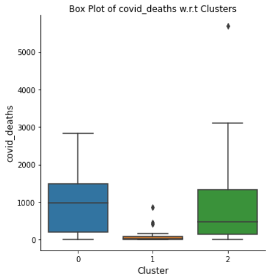

<h1>Face Recognition using FaceNet</h1>

<h6>Use Case</h6>

...

<h3> How does it work?</h3>

<h4>1. Face Verification vs Face Recognition</h4>

<h5>Face Verification</h5>

- Input image and name/ID.
- Output whether the input image is that of the claimed person.
- An accuracy of 99 percent is not at all a bad accuracy for a face verification model.

<h5>Face Recognition</h5>

- Has a database of K persons
- Get an input image
- Output ID if the image is any of the K persons.
- A face verification system can be used as a face recognition system if the accuracy of the face verification system is at least 99.9 percent.
- If a face verification system has 99 percent accuracy and the database has 100 persons, then the chance of making an error is 100 times as compared to the face verification problem. 
- We can first work on building a face verification system and if it's accuracy is high enough, we can then use it as a building block for a face verification system.

<h4>2. One Shot Learning</h4>

- A face recognition system should recognize a person given just one single image of the person. This is called one-shot learning problem.
- We could train a CNN using a softmax unit for the output y. However, this does not really work well because a small training set (just one image per person) is not sufficient to train a robust neural network for this task.
- Moreover, if a new person needs to be added, we have to retrain the CNN again.
- To address the above problems, we instead try to learn a similarity function.

<em>Image by Andrew Ng</em>

- A learnt similarity function would produce a small value of &tau; if a person matches with an image in the database.  Otherwise, the value of &tau; for the person would be high and hence, can be detected as a trespasser.
- Next, we will see how to train a neural network to learn the similarity function.

<h4>3. Siamese Network</h4>

<em>Image by Andrew Ng</em>

- A Siamese network outputs a feature vector of the input image. In this case, a 128 dimensional feature vector is outputted for the first image.
- When we input a second image, a new 128 dimensional feature vector is outputted corresponding to that image.
- We can then use these 128 dimensional feature vectors to calculate the L2 norm that can eventually be used to decide if the two images represent the same person or not.
- The Siamese Network was used for face verifcation in <a href="https://www.cs.toronto.edu/~ranzato/publications/taigman_cvpr14.pdf"><em>DeepFace</em></a>

<em>Image by Andrew Ng</em>

- As shown in the above image, the goal is to train a neural network such that the L2 norm of the feature vectors of different persons is large whereas the L2 norm of the feature vectors of the same person is small.
- The objective function that is used to make a neural network learn to do what has been described above is called triplet loss function

<h4>4. Triplet Loss Function</h4>

- One way to learn parameters of the neural network so that it gives us a good encoding for pictures of faces is to define and apply gradient descent on the triplet loss function.
- To apply the triplet loss, we need to compare pairs of images i.e; Anchor image and Positive image, and Anchor and Negative images

<em>Image by Andrew Ng</em>

- f(A), f(P) and f(N) are feature vectors of Anchor, Positive and Negative images.
- To obtain good feature vectors, the distance between Anchor and Positive (d(A,P)) should be less than or equal to the distance between Anchor and Negative (d(A,N)).
- However, this learning objective will be satisfied even if the neural network learns to output feature vectors with all zeros or if the neural network outputs the same feature vectors for Anchor, Positive and Negative images.
- In order to overcome this problem, we change the objective function such that the distance d(A,P) is less than or equal to the distance d(A,N) minus margin &alpha;.

- Loss Function

<em>Image by Andrew Ng (modified)</em>

- In the above image, a positive value for the underlined expression will force the network to make it less than or equal to zero.
- The overall loss function for training a Siamese network is:

<em>Image by Andrew Ng</em>

- In this project, I used <a href="https://arxiv.org/pdf/1503.03832.pdf"><em>FaceNet</em></a> which uses the triplet loss function for training the network.

<h4>5. Training</h4>

- The network is trained on triplet of images - Anchor, Positive and Negative.
- It matters how we choose Anchor, Positive and Negative images for training the network.
- If the triplets are chosen randomly especially the Anchor and the Negative images, then the triplet loss function can be easily satisfied by the network.
- Instead, we should train the network on the triplets that make it difficult to satisfy the triplet loss function.
- We should also make sure that there are multiple images of the same person to form pairs in the triplets i.e; A and P pairs.
- Once training is done, we can apply the network to the one shot learning problem.

[Go to top](#top)

[Code Implentation](https://www.google.com/)

<a href="https://www.google.com/"><em>google</em></a>