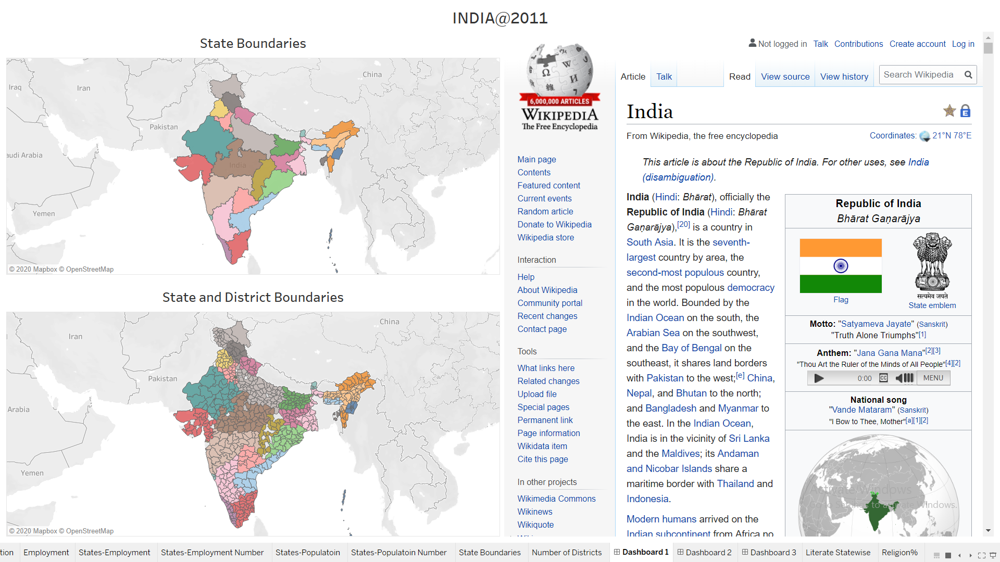
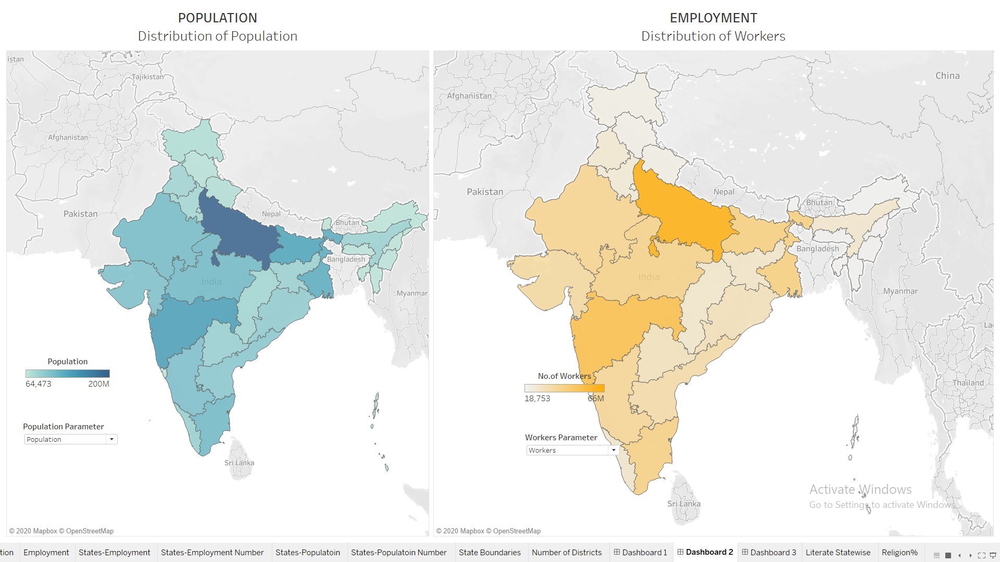
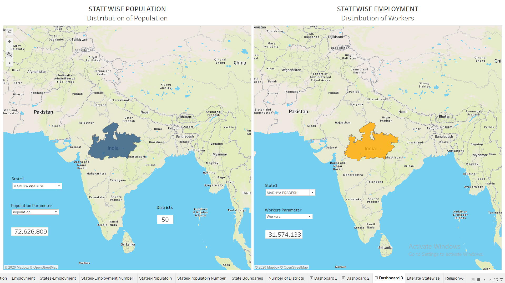
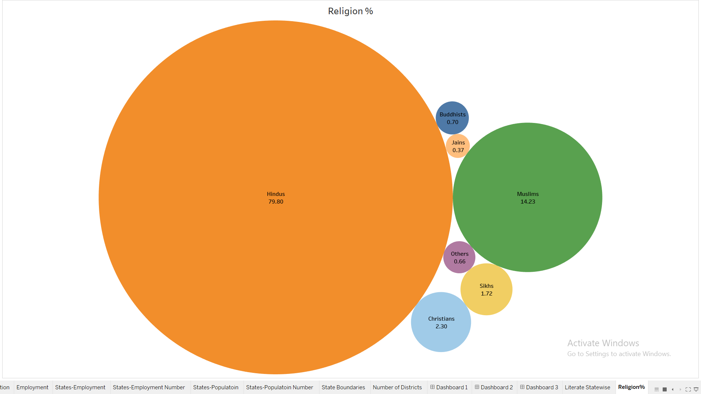

<h1>
INDIA Census 2011
</h1>

<a href="https://youtu.be/SdT4mogSeOk" target="_blank">Demo Video on Youtube</a>

First issue was this data dates back to 2011 when there was no Telangana.
I had to change the state name of the districts that are presently in Telangana.
To do this, I created a calculated field with an "if condition" in it.
If the district name is equal to the district name that is presently in Telangana(which I got from
Wikipedia), then change the state name to Telangana.

Next issue was plotting disticts on the Indian map.
Some of the Districts were not getting captured because 
there are two districts with the same name in two different states(Ambiguity Issue).
Or slight difference in the spellings in the data and that are present on the Indian map.

There were around 18 such issues. To resolve this, I
searched for the district name in the search bar of Tableau Map.
Used Point Annotate to extract latitude and longitude.
Then entered those values wherever there was such issue.

With these issue resolved, I moved on to making different plots and Dashboards.

Dashboard 1:
This dashboard contains States and Districts demarcations and also a webpage.
I have included a hyperlink action in this dashboard.
When clicked on any state or district, corresponding wikipedia page opens in the web page 
container.

Dashboard 2:
This dashboard shows distiribution of different measures related to Population and type of workers
between states.
I have used a parameter which is used to toggle between different measures. This paremeter has
been used in a calculated field to return corresponding measure by the calculated filed.
This calculated field is used to color the map
I have also used Highlight Action in this dashboard.
If a state is highlighted in one sheet then the corresponding state would also get highlighted
in the other sheet.

Dashboard3:

This dashboard shows the value of population measures and 
type of workers measures for the filtered state. 
The filter is applied across multiple sheets to change the value dynamically.

Sheet: Literate Statewise

I have used measure names and meauser values to create this sheet along with filter on 
measure names to show the bars only for Literacy related measures.
I have also used state filter to compare between states.

Sheet: Religion%

To create this bubble chart, I used measure values and measure names along with filter on
measure names to plot the values related to Religion meausures.