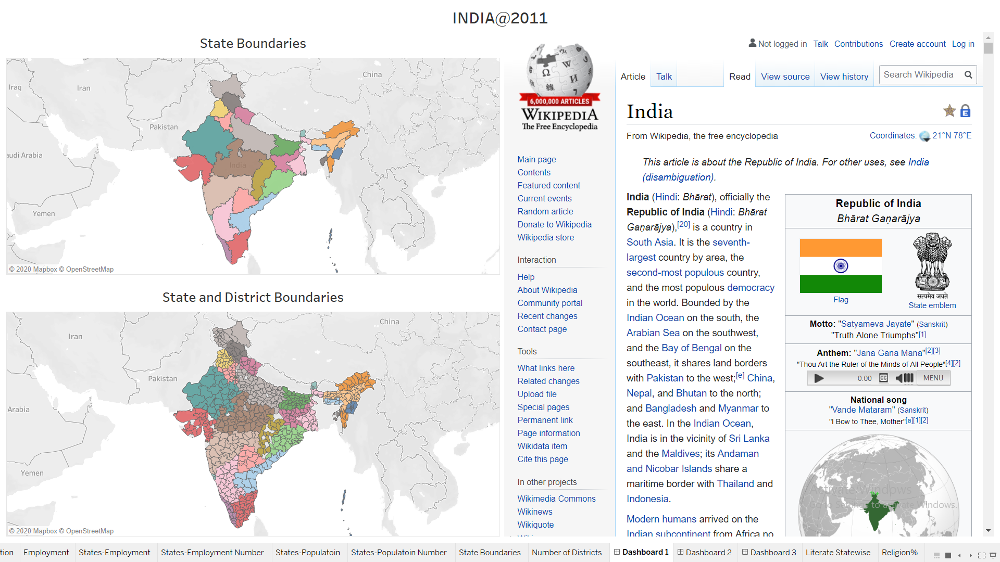
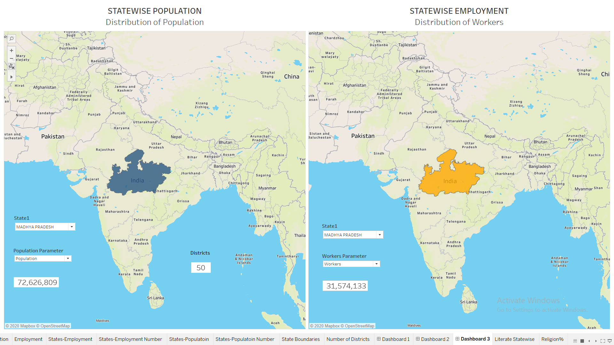
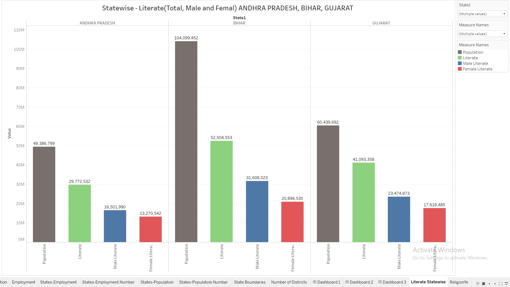
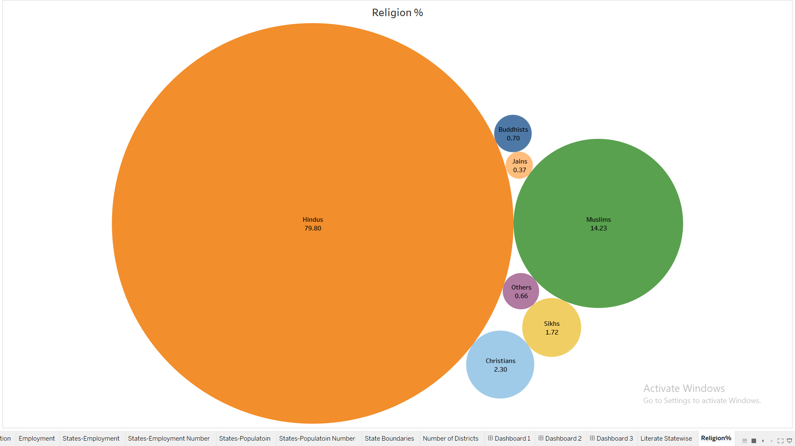

<h1>Tableau Projects</h1>

Table of Contents

1. [INDIA Census 2011](#india-census-2011)
2. [Amazing Mart](#amazing-mart)

<h2>1. INDIA Census 2011</h2>

<a href="https://youtu.be/JQp_TFWum94" target="_blank">Demo Video on Youtube</a>

<a href="https://public.tableau.com/profile/satya.venkatesh#!/vizhome/India2011_15779645968680/Dashboard1" target="_blank">Tableau Public Link</a>

<a href="https://youtu.be/SdT4mogSeOk" target="_blank">Demo Video on Youtube</a>

<a href="https://public.tableau.com/profile/satya.venkatesh#!/vizhome/India2011_15779645968680/Dashboard1" target="_blank">Tableau Public Link</a>

<h4> Concepts Used </h4>

- Maps
- Resolving Unknown values for plotting on the map with the help of point annotate
- Parameters
- Calculated Fields with Parameter
- Filters
- Measure values and Measure names
- Dashboard Layout
- Highlight and Hyperlink Dashboard Actions

<h4> About the Data Set </h4>

2011 India census data. Includes population/demographic data and housing data for each district.

<h4> Challenges with the Data Set </h4>

- First issue was this data dates back to 2011 when there was no Telangana. I had to change the state name of the districts that are presently in Telangana. To do this, I created a calculated field with an "if condition" in it. If the district name is equal to the district name that is presently in Telangana(which I got from Wikipedia), then change the state name to Telangana.

- Next issue was plotting districts on the Indian map. Some of the Districts were not getting captured because  there are two districts with the same name in two different states(Ambiguity Issue). Or slight difference in the spellings in the data and that are present on the Indian map.

- There were around 18 such issues. To resolve this, I searched for the district name in the search bar of Tableau Map. Used Point Annotate to extract latitude and longitude. Then entered those values wherever there was such issue.

With these issue resolved, I moved on to making different plots and Dashboards. 

<h4> Dashboard 1 </h4>
- This dashboard contains States and Districts demarcations and also a webpage. I have included a hyperlink action in this dashboard. When clicked on any state or district, corresponding Wikipedia page opens in the web page  container.

<h4> Dashboard 2 </h4>
- This dashboard shows distribution of different measures related to Population and type of workers
  between states. I have used a parameter which is used to toggle between different measures. This paremeter has been used in a calculated field to return corresponding measure by the calculated filed.
  This calculated field is used to color the map I have also used Highlight Action in this dashboard. If a state is highlighted in one sheet then the corresponding state would also get highlighted in the other sheet.

<h4> Dashboard3 </h4>

- This dashboard shows the value of population measures and type of workers measures for the filtered state. The filter is applied across multiple sheets to change the value dynamically.

<h4> Sheet: Literate Statewise </h4>

- I have used measure names and measure values to create this sheet along with filter on measure names to show the bars only for Literacy related measures. I have also used state filter to compare between states.

<h4> Sheet: Religion% </h4>

- To create this bubble chart, I used measure values and measure names along with filter on
  measure names to plot the values related to Religion measures.

<h2>2. Amazing Mart</h2>

<a href="https://youtu.be/o6ePhQAHmao" target="_blank">Demo Video on Youtube</a>

<a href="https://public.tableau.com/app/profile/satya.venkatesh/viz/AmazingMartEU-SalesReport/Dashboard1" target="_blank">Tableau Public Link</a>

 

<a href="https://youtu.be/o6ePhQAHmao" target="_blank">Demo Video on Youtube</a>

<a href="https://public.tableau.com/app/profile/satya.venkatesh/viz/AmazingMartEU-SalesReport/Dashboard1" target="_blank">Tableau Public Link</a>

<h3>Project description</h3>

Amazing Mart is a retail store chain that has customers throughout Europe. The dashboards were built using Tableau based on the data from 2011 to 2014.

The dashboards contain information regarding:

- Countries of operation and their market size
- Top 5 cities by Sales for each country
- Top 7 Sub-Categories by Sales in a country
- Comparison of sales between 2013 and 2014
- Sales and Profit per customer
- Sales and Target for each month
- Category Sales and Target
- Segment Details
- Sub-Category Sales and Profit
- Variation of Sales with respect to date

Concepts Used
- Maps
- Parameters
- Calculated Fields with Parameter
- Filters
- Dual Axis
- Dashboard Layout
- Dashboard Actions
- Various charts