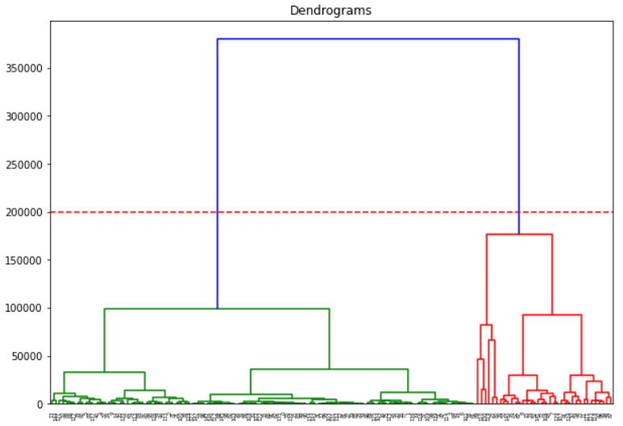

Please open the above IPython Notebooks to view the analysis as well as the code.

1. Linear Best Subset Selection, Ridge, Lasso and Polynomial Regression
2. Smoothing Splines
3. Gradient Boosting
4. Hybrid and Backward Selection Linear Regression

<b>Table of Contents</b>

<b>Overview</b>

1. [Task](#task)
2. [Results](#results)
3. [Verdict](#verdict)

<b>All About Regression</b>

1. [Linear Regression](#linear-regression)
2. [Best Subset Selection Method](#best-subset-selection-method)
3. [Backward Selection](#backward-selection)
4. [Forward Selection](#forward-selection)
5. [Hybrid Selection](#hybrid-selection)
6. [Ridge and Lasso Regression](#ridge-and-lasso-regression)
7. [Polynomial Regression](#polynomial-regression)
8. [Splines](#splines)
9. [Gradient Boosting](#gradient-boosting)

<h3>Overview</h3>

<a name = "task"></a><b>1. Task</b>

- Use the following regression techniques to come up with the best possible model for predicting the median house value in Boston suburbs.

1. Linear Regression with Best Subset Selection
2. Ridge Regression
3. Lasso Regression
4. Polynomial Regression with Best Subset Selection
5. Smoothing Spline
6. Gradient Boosting
7. Linear Regression with Hybrid Subset Selection
8. Linear Regression with Backward Subset Selection

Dataset

- [Boston Housing](https://www.kaggle.com/c/boston-housing) dataset contains housing values and other information about Boston suburbs.

- ```medv``` (median house value) for 506 neighborhoods around Boston are given. ```medv``` is the target variable.
- The data dictionary of the dataset can be found [here](https://www.kaggle.com/c/boston-housing).

<a name = "results"></a><b>2. Results</b>

| Model                                                        | MSE on Test set | Remarks                                                      |
| ------------------------------------------------------------ | --------------- | ------------------------------------------------------------ |
| Linear Regression with all features                          | 26.126          |                                                              |
| Linear Regression using features obtained using Best Subset Selection method | 26.542          | The MSE is almost same as the above model                    |
| Ridge Regression                                             | 24.122          | The regularized linear model seems to show not much improvement over the non-regularized model. |
| Lasso Regression                                             | 24.146          | The regularized linear model seems to show not much improvement over the non-regularized model. |
| Polynomial Regression(Degree: 2, all features)               | 19.474          | The polynomial regression model of degree 2 seems to be promising over linear models |
| Polynomial Regression(Degree: 2, Best Subset Selection features) | 18.8857         | The MSE is almost same as the above model.                   |
| Smoothing Spline                                             | 9.864           | There is a drastic reduction in the MSE. Of all the models, smoothing spline seems to be best suited for this dataset. |
| Gradient Boosting                                            | 15.67           | Gradient Boosting comes in second with respect to lowest MSE on the test data. |
| Linear Regression with Hybrid Subset Selection of features   | 31.61           | Hybrid subset selection performed worse than best subset selection method. |
| Linear Regression with Backward Subset Selection of features | 31.00           | Backward subset selection performed worse than best subset selection method. |

<a name = "verdict"></a><b>3. Verdict</b>: Smoothing Spline has the lowest MSE on the test dataset and hence, it should be used to predict the median house value in Boston suburbs.


<h3>All about Regression</h3>

<a name = "linear-regression"></a><h3>1. Linear Regression</h3>

- Linear Regression is a parametric method in that we assume the relationship between the predictor variables and the response variable to be linear.
- There are a few things to consider while building a linear regression model.
  - Outliers
  - High Leverage Points
  - Multi-collinearity
  - Non-constant variance
  - Non-linearity of the data

<b>Outliers</b>

- These are the data points which have unusually low or high values in the response variable.

<center></center><p style="text-align:center;"><em>The red point is an outlier</em></p>

- Though the outliers do not impact the fit of the model adversely, they can influence the residual standard error which is used to compute confidence intervals and p-values for the predictor variables.
- This can have implications for the interpretation of the fit.
- Hence, it is recommended to identify and deal with the outliers appropriately.
- One way of identifying the outliers in the dataset is by using studentized residuals. The data points having the studentized residual greater than 3 or less than -3 can be deemed to be outliers.

<center></center><p style="text-align:center;"><em>The red point is an outlier</em></p>

<b>High Leverage Points</b>

- These are the data points which have unusually low or high values in the predictor variables.

<center></center><p style="text-align:center;"><em>The red point numbered 41 has high leverage</em></p>

- These points can affect the fit of the model and hence, need to be removed from the dataset.
- High leverage points can be identified using the leverage statistic. 
- A point whose leverage statistic greatly exceeds (p+1)/n (where n is the number of observations and p is the number of predictor variables) can be regarded as a high leverage point.
- Outliers and high leverage points are also called as influence points.

<b>Multi-collinearity</b>

- Linear regression assumes an additive relationship between the predictors and the response i.e; the effect of X on Y is independent of other variables.
- This characteristic helps use quantify the change in the response variables per unit change in a particular predictor variable.
- If two or more variables are correlated which is termed as multi-collinearity, it would be difficult to separate out the individual effects of collinear variables on the response.
- We can identify the presence of multi-collinearity with the help of variance inflation factor (VIF). Variables having VIF greater that 5 or 10 are said to cause the problem of multi-collinearity.
- We can either drop the variables having high VIF or we can combine them to form a single variable.

<b>Non-constant variance</b>

- The error terms of a linear regression model should have constant variance. 

<center></center><p style="text-align:center;"><em>Constant Variance (Homoscedasticity)</em></p>

- Absence of constant variance is called heteroscedasticity.
- The presence of heteroscedasticity can have implication on the standard errors, confidence intervals, and hypothesis test.
- The presence of funnel shape in the residual plot indicates heteroscedasticity. Transforming the response variable using a concave function can reduce heteroscedasticity.

<center></center><p style="text-align:center;"><em>Heteroscedasticity</em></p>


<b> Non-linearity of the data</b>

- The linear regression model assumes a straight-line relationship between the predictors and the response.
- If the true relationship is non-linear, the conclusions we draw from a linear model do not hold true.
- Moreover, the linear model would be a subliminal model for such dataset.

- The non-linearity can be detected using the residual plot. Transforming the predictors (log(X), sqrt(X), or square(X)) can help us deal with the non-linearity in the dataset.

<center></center><p style="text-align:center;"><em>Presence of non-linearity</em></p>

- In the presence of non-linearity, using a more flexible model can also lead to a better fit on the data.

<a name = "best-subset-selection-method"></a><h3>2. Best Subset Selection Method</h3>

- Residual sum of squares (RSS) always decrease with addition of variables to the model. However, residual standard error (RSE) can decrease or increase depending upon the magnitude of change in the RSS after adding the new variables.
- In order to make sure that we get the least possible RSE with the variable we have, we can use best subset selection method to select the variables.
- In this method, we select the model that has the least RSE on the test dataset among all the models obtained by using all different combinations of the predictors.

<a name = "backward-selection"></a><h3>3. Backward Selection</h3>

- We start with all variables in the model, and remove the variable with the largest p-value—that is, the variable that is the least statistically significant. 
- The new (p − 1)-variable model is fit, and the variable with the largest p-value is removed. 
- This procedure continues until a stopping rule is reached. For instance, we
  may stop when all remaining variables have a p-value below some threshold.

<a name = "forward-selection"></a><h3>4. Forward Selection</h3>

- We begin with the null model—a model that contains an intercept but no predictors. 
- We then fit p simple linear regressions and add to the null model the variable that results in the lowest RSS. 
- We then add to that model the variable that results in the lowest RSS for the new two-variable model. This approach is continued until some stopping rule is satisfied.

<a name = "hybrid-selection"></a><h3>5. Hybrid Selection</h3>

- This is a combination of forward and backward selection. We start with no variables in the model, and as with forward selection, we add the variable that provides the best fit. 

- We continue to add variables one-by-one. Of course, the p-values for variables can become larger as new predictors are added to the model. 
- Hence, if at any point the p-value for one of the variables in the model rises above a certain threshold, then we remove that variable from the model. 
- We continue to perform these forward and backward steps until all variables in the model have a sufficiently low p-value, and all variables outside the model would have a large p-value if added to the model.

<a name = "ridge-and-lasso-regression"></a><h3>6. Ridge and Lasso Regression</h3>

- Provided that the true relationship between the response and the predictors is approximately linear, the least squares estimates will have low bias. 
- If n >> p—that is, if n, the number of observations, is much larger than p, the number of variables—then the least squares estimates tend to also have low  variance, and hence will perform well on test observations. 
- However, if n is not much larger than p, then there can be a lot of variability in the least squares fit,
  resulting in overfitting and consequently poor predictions on future observations not used in model training. 
- And if p > n, then there is no longer a unique least squares coefficient estimate: the variance
  is infinite so the method cannot be used at all. 
- By constraining or shrinking the estimated coefficients, we can often substantially reduce the variance at the cost of a negligible increase in bias. 
- The ridge regression regularizes its coefficients by adding l2 norm to its loss function(RSS) while the lasso regression constraints its coefficients by adding l1 norm to its loss function.
- Ridge regression will perform better when relatively small number of predictors are related to the response while the lasso regression will perform better when many predictors are related to the response in roughly equal amount.

<a name = "polynomial-regression"></a><h3>7. Polynomial Regression</h3>

- Polynomial regression extends the linear model by adding extra predictors, obtained by raising each of the original predictors to a power. For example, a cubic regression uses three variables, X, X2, and X3, as predictors. This approach provides a simple way to provide a nonlinear fit to data.

<center></center><p style="text-align:center;"><em>Polynomial Regression of degree 4</em></p>

- For large regression enough degree d, a polynomial regression allows us to produce an extremely non-linear curve which can lead to overfitting.
- Generally speaking, it is unusual to use d greater than 3 or 4 because for large values of d, the polynomial curve can become overly flexible and can take on some very strange shapes

<a name = "splines"></a><h3>8. Splines</h3>

- Regression splines are more flexible than polynomials. 
- They involve dividing the range of X into K distinct regions. Within each region, a polynomial function is fit to the data. 
- However, these polynomials are constrained so that they join smoothly at the region boundaries, or knots. Provided that the interval is divided into enough regions, this can produce an extremely flexible fit.

<center></center>

- Smoothing splines are similar to regression splines, but arise in a slightly different situation. Smoothing splines result from minimizing a residual sum of squares criterion subject to a smoothness penalty.

<center></center>

<a name = "gradient-boosting"></a><h3>9. Gradient Boosting</h3>

- In boosting, the trees are grown sequentially: each tree is grown using information from previously grown trees. 
- Boosting does not involve bootstrap sampling; instead each tree is fit on a modified version of the original data set.
- In boosting, we fit a tree using the current residuals, rather than the outcome Y , as the response.
- We then add this new decision tree into the fitted function in order to update the residuals. Each of these trees can be rather small, with just a few terminal nodes.
- By fitting small trees to the residuals, we slowly improve the function in areas where it does not perform well. 
- The shrinkage parameter λ slows the process down even further, allowing more and different shaped trees to attack the residuals. 
- In general, statistical learning approaches that learn slowly tend to perform well. Note that in boosting,  the construction of each tree depends strongly on the trees that have already been grown.


<em>Reference</em>

<em>1. An Introduction to Statistical Learning with Applications in R. Gareth James, Daniela Witten, Trevor Hastie, and Robert Tibshirani</em>


