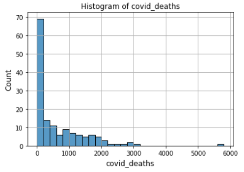
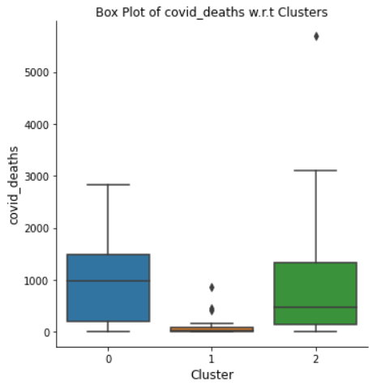
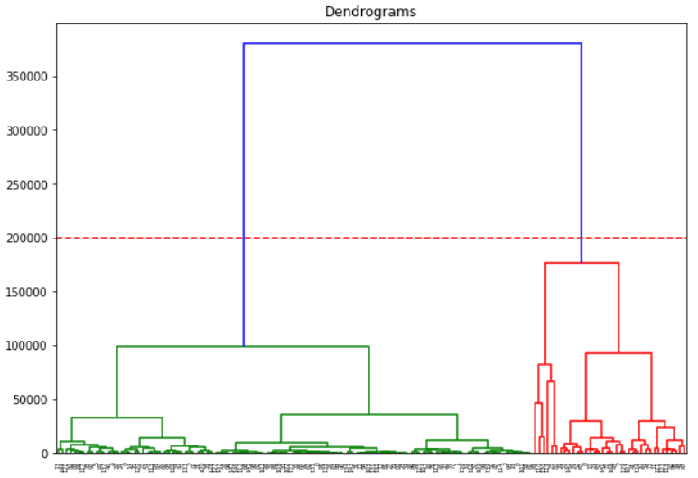
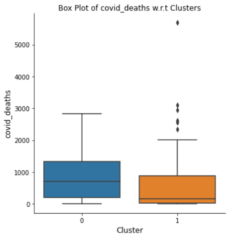

<h1>Object Detection using YOLOv3</h1>

**Use Cases**

- Object Detection for Self-Driving car in my village

- Detect backpacks to prohibit their entry into the Examination Hall

- Detect different objects for various purposes

<h3> How does it work?</h3>

<h4>1. Bounding Boxes</h4>

- Divide the image into 3x3 or 19x19 grid. For example, we will consider a 3x3 grid and assume that the dataset has 3 classes like pedestrian, car and motorcycle. Image classification and localization algorithm is then applied on each of the grid cells.
- As shown in the below image, for training, each image is divided into 9 grid cells. Each of the grid cells will have the target values y = [pc, bx, by, bh, bw, c1, c2, c3].

<em>Image by Andrew Ng</em>

- Grid cells marked in purple, green and yellow will have target value y as shown on right hand side of the above image.
  - pc = probability that the grid cell contains an object
  - bx = x-coordinate of the center of the bounding box
  - by = y-coordinate of the center of the bounding box
    - Top left corner of the grid cell has coordinates (0,0) and bottom right corner has coordinates (1,1)
  -  bh = fraction of overall height of the grid cell
  - bw = fraction of overall width of the gird cell
  - c1, c2, c3 = indicate class of the object

- So the target value of each image will be a 3x3x8 tensor
- The architecture of the model is such that it takes an input image(say 100x100x3) and the model outputs a tensor of shape 3x3x8.

<h4>2. Intersection over Union (IoU)</h4>

- IOU can be used for two purposes - for evaluating the model and for non-max suppression. We will first see how we can use IOU for evaluating the model.
- In the below image, the model has outputted the purple bounding box where as the red bounding box is the actual one. We can use IoU as a criteria to classify if the model predicted the bounding box correctly or not. 

<em>Image by Andrew Ng</em>

<h4>3. Non-max Suppression</h4>

- Since, image classification and localization is applied to each of the grid cells, it is highly likely that multiple grid cells can raise their hand and say, "My pc, my chance of thinking I have an object in it is large."
- So there can be multiple bounding boxed predicted for the same object.
- What non-max suppression does is it cleans up these detections.
- The working of non-max suppression is described in the following images (19x19 grid is taken in this case)

Image by Andrew Ng

<em>Image by Andrew Ng</em>

<em>Image by Andrew Ng</em>

- When we have multiple classes in the image, non-max suppression is applied for each of the classes independently.

<h4>4. Anchor Boxes</h4>

- So far, we have seen that each grid cell does not contain more than 1 object in it.
- What if a grid cell wants to detect multiple objects? Anchor Boxes facilitate detection of multiple objects in a single grid cell.
- In the below image, the midpoint of the pedestrian and the midpoint of the car are in almost the same place and both of them fall into the same grid cell.
- With the idea of anchor boxes, we pre-define two different shapes and associate two predictions with the two anchor boxes.

<em>Image by Andrew Ng (modified)</em>

- Each object in the training image is assigned to the grid cell that contains object's midpoint and anchor box for the grid cell with the highest IoU.

- Since the shape of the pedestrian is more similar to the shape of the anchor box 1, we're going to assign it to top half of the output vector. And the shape of the car is similar to anchor box 2. So the rest of the output vector will be associated with the car.

<h4>5. Bringing it all together</h4>

- For illustration purpose, let us consider 3x3 grid, 3 classes, and 2 anchor boxes.

<em>Image by Andrew Ng (modified)</em>

- The target variable for each of the grid cells will look as shown in the below image

Image by Andrew Ng (modified)

- Once training is complete, the model will output the target variable for each of the grid cells. Ideally, the model should output target values as shown in the below image.

<em>Image by Andrew Ng (modified)</em>

- For each grid cell, two bounding boxes are predicted since we are using two anchor boxes. Some of them will have very low pc. 

<em>Image by Andrew Ng</em>

- Those boxes having very low pc (probability) will be discarded.

<em>Image by Andrew Ng</em>

- Then, non-max suppression is applied for each of the classes independently to generate the final predictions.

<em>Image by Andrew Ng</em>

<h3>YOLv3 Architecture</h3>

- As mentioned in the [original paper](https://pjreddie.com/media/files/papers/YOLOv3.pdf) , YOLOv3 has 53 convolutional layers called Darknet-53 is shown in the following figure, which is mainly composed of Convolutional and Residual structures.

- It should be noted that the last three layers Avgpool, Connected and softmax layer are used for classification training on the Imagenet dataset. When we use the Darknet-53 layer to extract features from the picture, these three layers are not used.

- But from above Darknet-53 architecture figure it’s quite impossible to understand or imagine how Yolo v3 works, so here is another figure with Yolo v3 architecture:

<a href="https://pylessons.com/YOLOv3-TF2-introduction/"><em>Image Source</em></a>

- From the above architecture image, we can see that YOLO makes detection in 3 different scales in order to accommodate different objects size by using strides of 32, 16, and 8. This means, if we’ll feed an input image of size 416 x 416, YOLOv3 will make detection on the scale of 13 x 13, 26 x 26, and 52 x 52.
- YOLO performs coarse, medium, and fine meshing of the input image to enable the prediction of large, medium, and small objects, respectively. If the size of the input picture is 416X416, then the coarse, medium, and fine grid sizes are 13x13, 26x26, and 52x52 respectively.

<a href="link to code directory">Code Implementation update link to code directory</a> 

